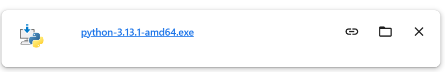
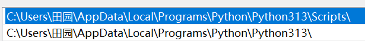
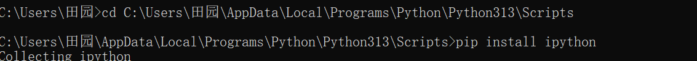
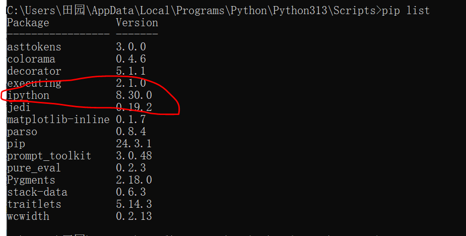
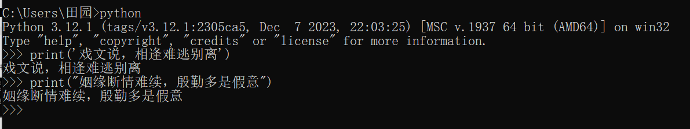
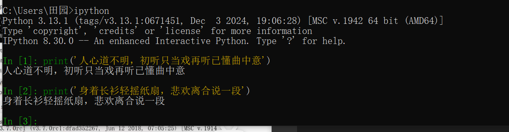
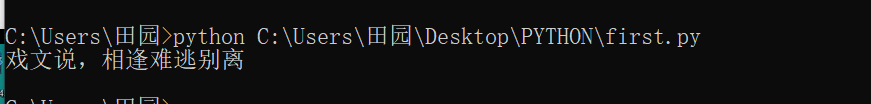

## PYTHON
## 一、PYTHON环境的安装
* 1.1 下载PYTHON
    * 去官网找，下载符合电脑的。官网：https://www.python.org/
* 1.2 安装
    * 
    * 安装时，不选择自动安装，选择自定义安装，将pip等全部勾选后，点击next，并勾选**Add Python 3.x to Path**，也就是选中添加环境变量后，再继续安装。
* 1.3 测试是否安装成功
    * 在命令提示符，输入python，可查看版本，并查看是否安装成功。
* 1.4 手动配置Python
    * 若未按照上一个步骤进行，可手动配置。桌面上右键点击此电脑，点击属性，继续点击高级系统设置，点击环境变量，选中USER的用户变量中的Path后，点击编辑，再点击新建，填写好路径即可添加到下载python的盘中。记得点击三个确定。
## 二、pip的使用
* pip是一个现代的、通用的Python包管理工具。提供了对Python包的查找、下载、安装、卸载的功能，便于我们对Python的资源包进行管理。相当于学习前端时的npm和yarn。
* 2.1 安装
    * 安装Python是，会自动下载并安装pip。
* 2.2 配置
    * 在Windows命令行里，输入```pip -V```，即可查看pip版本。
        * 
    * 但若在命令行里，运行```pip -V```，出现如下提示：
        * 
    * 可能是因为在安装Python的过程中未勾选**Add Python 3.x to Path**选项的缘故，需要手动昂配置pip环境变量，具体步骤看一，只不过要正确输入路径，下面是我的路径。
        * 
* 2.3 使用pip管理Python包
    * pip install <包名>：安装指定的包，包大还是包小，等一会儿出现Successfully installed巴拉巴拉，即意味着安装成功。前提是没有输错字母。
        * 
    * pip uninstall <包名>：卸载/删除指定的包
    * pip list ：显示已经安装的包，可查看已安装成功的包。
        * 
    * pip freeze：显示已经安装的包，并以指定的格式显示，会把依赖的第三方也给展示出来。
* 2.4 修改pip下载源
    *   运行pip install命令会从网站上下载指定的python包，默认是从https://files.pythonhosted.org/ 网站上下载。这是国外的网站，遇到网络不稳定的情况时，可能会下载失败，因此可以通过命令，修改pip现在软件时的源。
    * 格式： ```pip install 包名 -i 国内源地址```(这个-绝对不能省略)
    * 示例：
        * ```pip install ipython -i https://pypi.mirrors.ustc.edu.cn/simple/```，就是从中国科技大学(ustc)的服务器上下载requests(给予python的第三番文本框架)
    * 国内常用的pip下载源列表：
        * 阿里云：https://mirrors.aliyun.com/pypi/simple/
        * 中国科技大学：https://pypi.mirrors.ustc.edu.cn/simple/
        * 豆瓣：https://pypi.douban.com/simple/  (老师推荐使用)
        * 清华大学：https://pypi.tuna.tsinghua.edu.cn/simple/
        * 中国科学技术大学：https://pypi.mirrors.ustc.edu.cn/simple/
## 三、运行Python程序
* 3.1 终端运行
    * 1. 直接在python解析器中书写代码，缺点是无法保存到本地或硬盘中。
        * 
        * 如何退出python环境，就是上面那个环境
            * 1. exit()
            * 2. Ctrl+z
    * 2. 使用ipython解析器编写代码
        * 使用pip命令，可以快速安装ipython，不要写在python根目录下，直接在当前目录编写即可。但这两种方法有个共同的缺点，就是无法保存文件到本地或硬盘当中，不利于二次开发。
            * ```pip install ipython -i https://pypi.douban.com/simple```
            * 成功安装ipython后，在当前目录下输入ipython进入ipython的环境中，即可编写代码。
            * 
* 3.2 运行python文件
    * 使用python指令，运行后缀为.py的python文件
        * 
* 3.3 Pycharm(最常用)
    * 上述两种方法能够使用并提高编码速度，但面对更复杂的要求就显得无比麻烦。一般情况下，需要借助工具来辅助我们快速地搭建环境，编写代码以及运行程序。
    * IDE的概念
        * IDE(Integrated Development Environment)又称为集成开发环境。解释一下就是，有一款图形化界面的软件，它集成了编辑代码，编译代码，分析代码，执行代码以及调试代码等功能。在Python开发中，最常用的IDE是Pycharm。除了Pycharm还有我在学前端是常用的VSCode、WenStorm等，但Pycharm是最常用的。
    * pycharm是由捷克公司JetBrains开发的一款IDE，提供代码分析、图形化调试器、集成测试器、集成版本控制系统等，主要用于编写Python代码。下载社区版，因为这个免费。
        * 下载地址：https://www.jetbrains.com/pycharm/download/?section=windows
        * Pycharm的安装
            * 双击安装文件
            * 自定义安装路径，但我没自定义
            * 编辑设置(全部选中)
            * 安装完成后双击
            * 可设置主题，左下角设置->设置->外观中可选择喜欢的主题
* 3.4 Pycharm的使用介绍
    * 运行Pycharm，选择新建项目，创建一个新的Python工程。到此我是用VSCode书写的代码和笔记，鉴于已经有了一个有关Python的文件夹，在Pycharm就直接打开已有文件夹了。
    * 从这儿开始是在Pycharm写的笔记。创建或打开一个项目或文件夹后，选择'Pure Python'创建一个新的纯Python工程项目，Location表示该项目的保存路径，Interpreter用来指定Python解释器的版本。
      * 
    * 右键项目，选择新建，再选择Python文件，即可创建一个python文件，命名为testPython，写好代码后，右键选择运行XXX文件即可，或者左下侧有个三角形，点那个也是运行，但要明确运行的文件。
      * 
      * 
      * 
    * 页面布局介绍
      * 文件导航区域，就是查找、定位、打开项目文件的区域。
      * 文件编辑区域，能够编写当前选中的文件里的代码。
      * 控制台区域，用于输出程序执行内容，跟踪代码调试的执行。
    * 基本使用和配置
      * Pycharm左下侧有个如图示的图标，这是终端，点击后，输入python进入python环境，与命令提示符的终端效果一样。
        * 
      * 点击左上侧文件的设置，在文件和代码模板中可设置编码格式，如项目创建时间，作者名，文件名以及项目名称，之后可以根据公司的要求，设置更多编码格式
        * 
        * 
## 四、Python
* 4.1 注释
  * 1. 注释介绍
    * 在工作编码的过程中，如果一段代码的逻辑比较复杂，不是特别容易理解，可以适当地添加注释，以辅助自己活其他编码人员解读代码。
    * 注：注释是给程序员看的，是为了让程序员方便阅读代码，解释器会忽略注释。使用自己熟悉的语言，适当地对代码进行注释，说明该程序员有良好的编码习惯。
  * 2. 注释的分类
    * 在Python中支持单行注释和多行注释。
    * **单行注释**
      * 一般情况下注释写在代码的上面，只对当前行有效，shift+3或Ctrl+/(这是快捷键方法)都可，有时也会写在代码后面，但比较少，绝对不能写在前面。
      * 
    * **多行注释**
      * 用三个单引号(''')开始，三个单引号(''')结束。
      * 
* 4.2 变量以及数据类型
  * 1. 变量的定义
    * 对于重复使用，并且需要经常修改的数据，可以定义为变量，来提高编程效率。
    * 定义变量的语法为：变量名=变量值(这里的=的意思是赋值，这点跟js里一样)
    * 定义变量后可以使用变量名来访问变量值。
      * ```
          print("Who says, you're not perfect")
          print("Who says, you're not worth it")
          print("Who says, you're the only one that's hurting")
          print("Trust me that's the price of beauty")
          print("Who says, you're not pretty")
          print("Who says, you're not beautiful")
        
          # 使用变量
          whosays="Who says,you're not perfect"
          print(whosays)
        ```
      * 
      * 
    * 说明：
      * 变量即可以变化的量，可以随时进行修改。
      * 程序就是用来处理的，而变量就是用来存储数据的。
  * 2. 变量的类型
    * 程序中：在Python里为了应对不同的业务需求，也把数据分为不同的类型，基本数据类型和高级数据类型
      * 基本数据类型：
        * Numbers(数字)，**最需要掌握的就是int和float**
          * int(有符号整型)，就是整数。
          * long(长整型，也可以代表八进制和十六进制)，Python3.x中，已不使用，它是Python2的
          * float(浮点型)，就是小数。
          * complex(复数)，在爬虫中不用，但有实数和虚数的就是复数，eg:c=a+bj
        * 布尔类型：True&False
        * String(字符串)，就是让单或双引号圈起来的内容。
      * 高级数据类型：
        * List(列表)，用列表描述很多个数据。
          * 应用场景：当获取到了很多数据的时候，可以将它们存储到列表中，并直接使用到列表访问。
        * Tuple(元组)，与List类似，用一个数据代表很多个数据的集合。
        * Dictionary(字典)，
  * 3. 查看数据类型
    * 在python中，只要定义一个变量，并且它有数据，那么它的类型就已经确定了，不需要开发者主动地说明他的类型，系统会自动识别，意思就是**变量没有类型，数据才有类型**。
    * 如果临时想要查看一个变量存储的数据类型，可以使用type方法来查看变量存储的数据类型。格式：type(变量名)
      * 
* 4.3 标识符和关键字
  * 计算机编程语言中，标识符，也叫变量名，它是用户编程时使用的名字，用于给变量、常量、函数、语句块等命名，已建立起名称与使用之间的关系，但须注意以下三点。
    * 标识符/变量名由字母、下划线和数字组成，且绝对不能以数字开头。
      * 
    * 严格区分大小写。
      * 
    * 不能使用关键字。是Python中已经写好的，有特殊功能的，比如，for，False，True，while等。
      * 
      * 
    * 1. 命名规范
      * 标识符命名，要做到顾名思义。尽量取一个有意义的名字，做到让人一眼就能看出其用途和功能，也是为了提高代码可读性和效率的方式。比如，想定义一个人名，就用name；想定义一种动物，就用那个动物的英文单词cat，puppy，fish等。
      * 遵守一些命名规范。
        * 驼峰命名法，又分为大驼峰命名法和小驼峰命名法。
          * (1). 大驼峰命名法(lower camel case)：每一个单词的首字母都采用大写字母，例如：FirstName、LastName，UpperCamelCase等。
          * (2). 小驼峰命名法(upper camel case)：第一个单词以小写字母开始，第二个单词首字母大写，例如：userName、submitForm，lowerCamelCase等。
        * 还有一种就是用下划线来连接两个单词，如，current_state，user_name等。Python的命令瑰色遵循PEP8标准。
    * 2. 关键字
      * 关键字的概念。是指一些具有特殊功能的标识符，是已经被python官方使用了的，所以不允许开发者自己定义和关键字相同名字的标识符。
      * 
* 4.4 类型转换
  * 
  * 转换为整型
    * string --> int
    * float --> int
    * boolean  --> int
      * True会被转换为数字1，False会被转换为数字0.
    * string --> int
      * 在这里需要注意一点，转换字符串为整型时，字符串中不可有非法字符，如小数点。在两种情况下，会导致转换失败，一个是像图片里一样的小数字符串 ；另一个是含有字母的字符串，因为都包含非法字符，不能转换为整型。
        * 
        * 
  * 转换为浮点数
    * string --> float，在爬虫时，获取的大部分都是String类型，但实际上需要的是对应的float类型，因此需要进行类型转换。
    * int --> float
  * 转换为字符串，将当前的数据和其他的数据进行拼接时，会用到。举个例子的话，在一个网页最底部，翻到下一页时，其对应的网址会跟着发生改变，代表翻到了第几页，就是页码和域名的拼接，此时就可能需要将int转换为string来进行拼接。只是强制转换为字符串的方法与前几个有所不同，想要转换为string类型使用str()即可，string()这方法不合法。且打印出转换后的结果没有用引号包裹，这是因为Pycharm在显示时进行了优化，用type方法，可以查看到确实成功转换了。
    * int --> string
    * float --> string
    * boolean --> string
  * 转换为布尔值
    * int --> boolean，如果对非零的整型进行bool类型的转换，那么全是True，甚至负数也是True；在整数的范围内，0强制类型转换为bool类型的结果是False。
    * float --> boolean，与int一样，只要是非零，无论正负，强制转换为bool类型的结果都是True；如果是0.0，转换结果就是False。
    * string --> boolean，只要字符串中有内容，在强制类型转换为bool类型是，就会返回True，就算是空格转换结果也是True，也就是非空即是True。值得注意的是，无论是单双引号不影响前面那句话。
    * list --> boolean，只要列表中有数据，强制类型转换为bool类型时，返回的结果就是True；若列表中没有任何数据，强制类型转换结果为False。
    * tuple -- boolean，只要元组中有数据，在强制类型转换为bool类型时，就会返回True；但若元组中没有数据，就会返回False。
    * dictionary --> boolean，只要字典中有数据，在强制类型转换为bool类型时，返回结果就是True；否则，返回False。
* 4.5 运算符
  * 1. 算术运算符 
    * ```
        a=5
        b=2
        
        # + 加
        print(a+b)  #7
        
        # - 减
        print(a-b)  #3
        
        # * 乘
        print(a*b)  #10
        
        # / 除
        print(a/b)  #2.5
        
        # // 取整除，就是取整数部分，它的结果有且只有一种就是int类型
        print(a // b)   #2
        
        # % 取余，就是整除后剩下来的那个
        print(a%b)  #1
        
        # ** 指数，就是a的b次幂
        print(a**b) #25
        
        # () 小括号，提高运算优先级
        print(a*(a+b))  #35
      ```
    * 注意：混合运算时，优先级顺序为**(指数运算)高于*(乘)、/(除)、%(取余)、//(取整除)高于+、-，为了避免歧义，建议使用()来处理运算符优先级。
    * 并且不同类型的数字进行混合运算时，整数将会转换为浮点数进行运算。
    * 扩展：
      * 可以用 +(加法) 进行两个字符串的拼接，但只限于相同数据类型之间，字符串和整型显然是不能使用加法来实现拼接的，若硬要实现，需要将int类型转换为string类型。
        * 乘法运用在字符串中就会把字符串的内容重复N次。
          * ```
              a='初听只当戏，再听已懂曲中意。'
              print(a*3)  #初听只当戏，再听已懂曲中意。初听只当戏，再听已懂曲中意。初听只当戏，再听已懂曲中意。
            ``` 
  * 2. 赋值运算符，就是把等号右边的结果赋值给左边的变量。示例如下：
    * ```
        # 为单个变量赋值
        a=8
        print(a)
      
        # 同时为多个变量赋值，按下面的例子，将数据23先赋值给变量c，再将以获取数据的变量c赋值给变量b。
        b=c=23
        print(b)    #23
        print(c)    #23
      
        # 多个变量赋值，用逗号进行分隔，同时给多个变量赋值不同的数据。
        d,e,f=67,'身着长衫轻摇纸扇',False
        print(d)    #67
        print(e)    #身着长衫轻摇纸扇
        print(f)    #False
      ```
  * 3. 复合赋值运算符，用在元组和列表结合操作上。
    * +=，加法赋值运算符
      * ```
         a=1
         # += 加法赋值运算符
         # a=a+2
         a += 2   #等于a=a+2
         print(a)    #3
        ```
    * -=，减法赋值运算符
      * ```
         b=2
         # -= 减法赋值运算符
         # b=b-3
         b -= 3
         print(b)    #-1
        ```
    * *=，乘法赋值运算符
      * ```
         c=2
         # *= 乘法赋值运算符
         # c=c*0
         c *= 0
         print(c)    #0
        ```
    * /=，除法赋值运算符
      * ```
         # /= 除法赋值运算符
         d=5
         d=d/4
         # d /= 4
         print(d)    #1.25
        ```
    * //=，取整除赋值运算符
      * ```
         # //= 取整除赋值运算符
         e=7
         # e=e//3
         e //= 3
         print(e)    #2
        ```
    * %=，取模赋值运算符
      * ```
         # %= 取模赋值运算符
         f=8
         # f=f%5
         f %= 5
         print(f)    #3
        ```
    * **=，幂赋值运算符
      * ```
         # **= 幂赋值运算符
         g=2
         # f=f**3
         g **=3
         print(g)    #8
        ```
  * 4. 比较运算符返回的都是布尔类型的数据
    * ==，是判断==两边的变量是否一致
    * !=，是判断!=两边的变量是否不一致
      * 扩展：<> Python2使用的是这个，Python3中已不再使用它来表示不等式，若坚持使用会报Python3.13不再支持该种写法的错。
    * >，判断>左边的变量是否大于右边的变量
    * >=，判断>=左边的变量是否大于或等于右边的变量
    * <，判断<左边的变量是否小于右边的变量
    * <=，判断<=左边的变量是否小于或等于右边的变量
  * 5. 逻辑运算符
    * and，与，and两端的结果必须都是True，才会返回True，只要有一端不满足该条件，返回的结果就是False。
    * or，或，or的两端中，有一端满足结果为True的情况下，最终会返回True，但必须有一端返回的就是True，否则返回的依旧是False。
    * not，非，取反
    * 性能提升：
      * and   短路与，and两端的条件都必须满足才可执行，有一端不满足则不会执行。
        * 
      * or    短路或，or前面那一端的结果是False才会考虑后面那一端的执行，若or前面结果是True，后面的将不会执行，所以想要使用or，还想执行语句或其他代码，那就写在or的前面
        * 
* 4.6 输入输出
  * 1. 输出
    * 普通输出，就是print()，若有int和string类型的话，需要将int类型转换为string类型，会比较麻烦
    * 格式化输出，会在scrapy框架中用到，爬虫后会生成json文件，可以放到excel文件或mysql又或者放到redis数据库中。在Python中最常用的就是%s和%d，%d代表数值，%s代表字符串的缩写。具体例子如下：
      * ```
        age=29
        name='谷江山'
        print('大家好，我是729声工场的配音演员%s，今年%d岁' % (name,age))
        ```
  * 2. 输入
    * 不同于前端，Python中input是一个函数，在前端它是一个可以输入内容的输入框标签，就是这个<input/>。调用input函数，运行py文件可以在控制台输入内容，点击回车键，输入的内容可以打印出来。
      * 
* 4.7 流程控制语句
  * 1. if判断语句
    * if语句是用来进行判断的，其格式为：
      * if 要判断的条件：
            满足条件时，要做的事
      * 
      * 
    * 需要注意的一个点是，调用input方法，返回的是一个字符串类型，若在控制台输入的是一个int，就会报错，此时就需要将input返回的强制转换为int类型，再进行比较。
  * 2. if else
    * 当满足判断条件时，执行if下代码，当不满足判断条件时，执行else下代码。
  * 3. elif
  * 4. for
  * 5. range
* 4.8 高级数据类型
